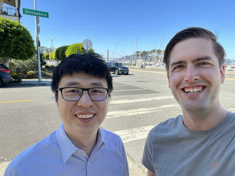

# Team

### [Jared Rhizor](https://www.linkedin.com/in/jrhizor/)

Jared is a seasoned tech professional with a track record of success. 
As a data engineer at LiveRamp, he led the team responsible for maintaining one of the industry's largest device graphs. 
He was also a key player in the early days of Airbyte.
As the first engineer, he helped to build and grow the open source project from pre-idea to a massively deployed system processing hundreds of terabytes of data for thousands of users.

### [Liren Tu](https://www.linkedin.com/in/tuliren/)

Liren is a software engineer.
At LiveRamp, he developed and maintained multiple internal developer tools while leading application teams focused on data engineering at the petabyte scale. 
He was also a founding engineer for the Scale NLP team, helping to take the product from nothing to product-market-fit. 
Most recently at Airbyte, Liren wrote tools that reduced the time needed to create API integrations by hours.

# Interested in working with us?

Stoat isn't hiring at the moment, but please [drop us a line](mailto:contact@stoat.dev) if you want to be the first to know when a position opens.
We plan on hiring some engineers and someone to lead devrel at some point after fundraising.
