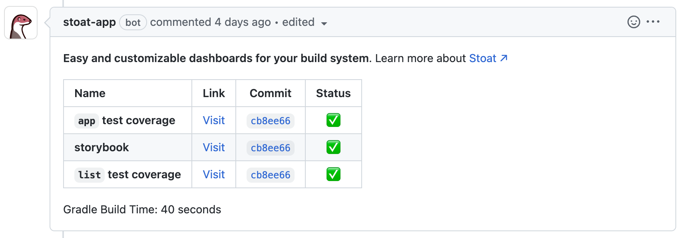

import Docusaurus from '../static/img/examples/docusaurus-logo.svg'
import JaCoCo from '../static/img/examples/jacoco-logo.svg'
import Jest from '../static/img/examples/jest-logo.svg'
import StorybookLogo from '../static/img/examples/storybook-logo.svg'

# What is Stoat?

Stoat is a tool that helps users aggregate data from GitHub builds into a single
GitHub PR comment that is updated as new data becomes available. You can think of this
static comment as a customizable dashboard for your PR build.

With just a couple of minutes configuration, you can automatically add PR comments that contain links to test coverage reports, Storybook.js component summaries, build time summaries, and more:

## Quick Start

Check out some [examples](category/quick-start) to quickly setup Stoat for these popular applications:

<ul>
  <li><Docusaurus width={16} height={16} />&nbsp;&nbsp;<a href="quick-start/docusaurus">Docusaurus</a></li>
  <li><JaCoCo width={16} height={16} />&nbsp;&nbsp;<a href="quick-start/jacoco">Jacoco Test Coverage</a></li>
  <li><Jest width={16} height={16} />&nbsp;&nbsp;<a href="quick-start/jest">Jest Test Coverage</a></li>
  <li><StorybookLogo width={13} height={16} />&nbsp;&nbsp;<a href="quick-start/storybook">Storybook</a></li>
</ul>

## How it works

Stoat consists of a [GitHub Application](https://github.com/apps/stoat-app) and a [GitHub Action](https://github.com/stoat-dev/stoat-action).

The GitHub Action pushes data for a specific build to the Stoat servers. This data might be files produced as side effects of a build, such as
code coverage reports, frontend component previews, or documentation pages. This data might also be any JSON blob, that may represent
data such as test runtimes or any other values that are computed as part of the build.

The GitHub Application listens for any changes for a PR and the Stoat servers to render a static comment on every
PR. We call this a "static comment" because unlike some GitHub tools that create new comments on every change, Stoat creates 
a single comment and updates it as changes come in. 
If you've ever used a combination of calls to the [`create-or-update-comment` GitHub action](https://github.com/peter-evans/create-or-update-comment), Stoat
is likely an easier-to-use replacement.

## Static hosting

Does your build produce any artifacts that you'd like to be able to access from your PR instantly? Try out our [static hosting tutorial](tutorials/static-hosting)!

## Templating

Want to summarize any data from your builds? Try out our [templating tutorial](tutorials/templating)!
